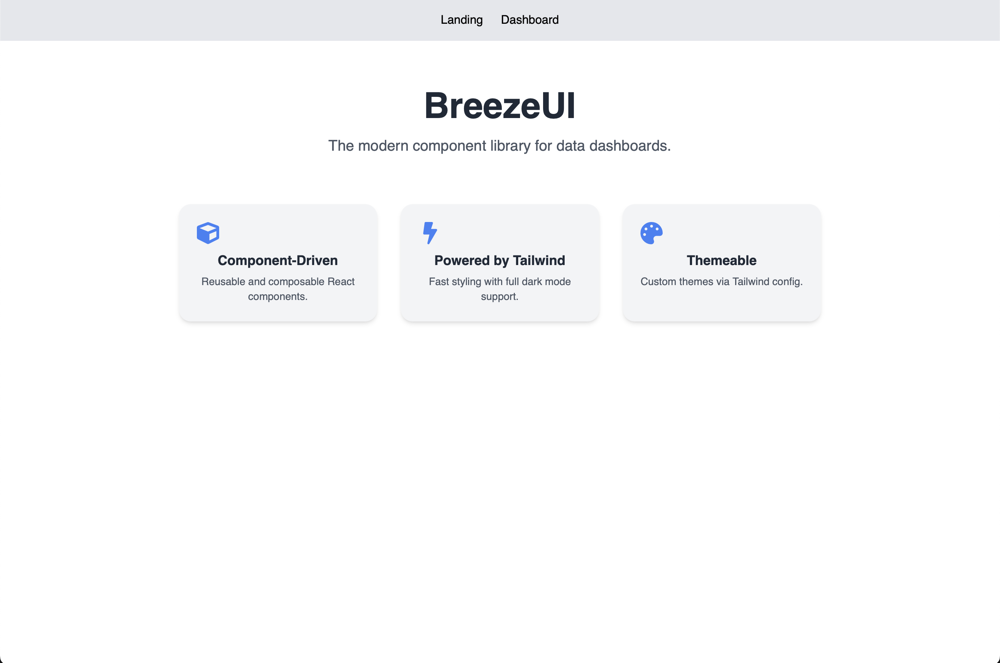

# 🌬️ BreezeUI

**BreezeUI** is a modern, responsive component library built with **React**, **TypeScript**, **Tailwind CSS**, and **Storybook** — designed for building beautiful **data dashboards** effortlessly.

---

## 🚀 Features

- ⚛️ Built with **React + TypeScript**
- 🎨 Styled using **Tailwind CSS**
- 🧩 Prebuilt UI components: Cards, Buttons, Navbar, etc.
- 🌗 Supports **dark mode**
- 🧪 Interactive documentation with **Storybook**
- 📱 Responsive out of the box
- 🛠️ Easy to customize and extend

---

## 📸 Preview



> _Lightweight, elegant UI components made for dashboards._

---

## 📦 Installation

```bash
npm install react-breezeui
```
